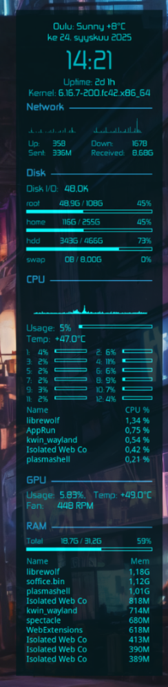

# Some of my configuration files for Linux / Unix applications

These are managed by [Yet Another Dotfiles Manager - yadm](https://yadm.io/) which is basically a wrapper for Git bare repos.

Contains configurations for

- `Zsh` shell (submodule)
- `Neovim` text editor (submodule)
- `Bash`shell
- `scripts/` - Misc sh/bash shell scripts I've wrote (submodule).
- `Conky`system monitor
- `Kitty` erminal emulator
- `Aerc` mail client
- `xkb` X keyboard extension. Implementation of [finner](https://github.com/ruohola/finner) - Windows/Mac keyboard layout for Linux.
- `Cheat` command line tool
- `Kate` text editor
- `LazyGit` Git client
- `Micro` text editor
- `Starship` cross-shell prompt

## File structure

```
~
├── .bash_profile
├── .bashrc
├── .config
│   ├── aerc
│   ├── bash
│   ├── cheat
│   ├── conky
│   ├── ctags
│   ├── kate
│   ├── kitty
│   ├── lazygit
│   ├── micro
│   ├── nvim
│   │   └── custom
│   ├── picom.conf
│   ├── starship.toml
│   ├── xkb
│   └── zsh
├── .gitmodules
├── .local
│   └── share
│       └── ktexteditor_snippets
├── README.md
└── scripts
```

## Conky

[conky](https://github.com/brndnmtthws/conky) is light-weight system monitor for X, Wayland, and other things. This configuration LUA script makes Conky display info in futuristic fashion at side of desktop wallpaper.



Features

Weather info, time, uptime, kernel version, network upload/download and graphs, sent and received data, disk I/O, show disk space for different disks, CPU usage, graph, and
temperature, utilization of different cores, names of processes which use most CPU,
GPU usage, temperature and fan speed, RAM usage and top processes which use most RAM.


